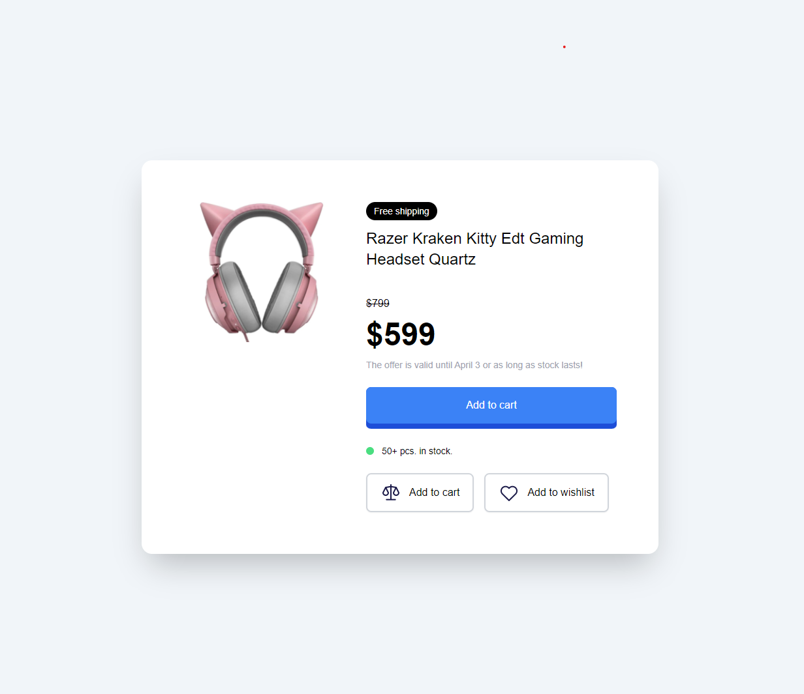

# Product Modal Project

Product Modal mini-project from my Tailwind course [Tailwind CSS From Scratch | Learn by building projects] by Brad Traversy.

In this mini project i styled a product pricing card in modal look alike form

First we have an image of the Headset & a little information below it.
We've also got other informative contents about this product below it that were all styled using Tailwind

I added nice animations to the image & buttons, and also a nice ping animation below the blue button

The icons on the last two buttons are images i got from the tutor

And note that on small screen, every content stacks on each other but on medium and wider screen, the image and content stays side by side

I used tailwind custom fonts

